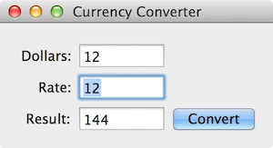
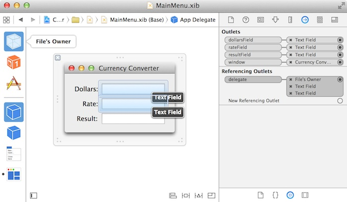
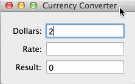

この記事は[Haskell Advent Calendar 2014](http://qiita.com/advent-calendar/2014/haskell) の 13日目の記事です。前日は[arrowM さんの「Haskell rest フレームワークでREST API設計をサボる」](http://qiita.com/minpou/items/20ba354b32af89b20c64)、翌日は[solorabさんの「Haskellのlensの使い方」](http://solorab.net/blog/2014/12/14/how-to-use-lens-a/)です。

対象読者は、これから Cocoa アプリ開発で Haskell を使いたいと思っている Haskell プログラマです。Objective-C （以下、Obj-C）がなんとなく読めればよりよいでしょうが、私じしんそこまで Obj-C は得意ではないので、まあ読めなくても何とかなるでしょう。また、本稿では OS X 向けの Cocoa 開発を対象とし、iOS アプリの開発は扱いません[^1]。また、以下で扱う`language-c-inline`は専ら Obj-Cとの連携に注力されていますが、普通のC言語との交ぜ書きも同じ要領で出来る筈なので、OS Xとか知らねーし！みたいな不逞の輩（！）な皆さんの参考にもなるのではないかと思います。

以下で採り上げる例は、全て[GitHubで閲覧可能](https://github.com/konn/objc-tutor)です。

Haskell で Cocoaアプリ開発？
==========================
その昔、HaskellでCocoaアプリ開発をするためのライブラリとして、[HOC](http://hoc.sourceforge.net/)というものがありました。これはCocoa APIに対する包括的なラッパーライブラリを提供することを企図したものでしたが、現在ではもうメンテナンスされておらず、Haskell / Obj-C 双方の変化に追随出来ていません。

今回以下で紹介するのは[`language-c-inline`](http://hackage.haskell.org/package/language-c-inline)を用いる方法です。名前に *inline* と入っている事からも推察出来るように、今回採る方法は巨大なラッパライブラリを利用するのではなく、Haskellのプログラムの中に Obj-C のコードを交ぜ書きするスタイルです。

ですので、Obj-Cを自分で書かなければならないという点ではラッパライブラリを用いるのに較べて少し手間かもしれません。しかし、ラッパを使うにしてもちゃんとしたプログラムを書くには、CocoaのAPIリファレンスを読まなくてはいけない訳ですし、さして必要な労力は変わらないでしょう。

また、`language-c-inline`じたいは、HOCが提供していたような、Obj-Cのオブジェクト・システムを再現するための機構は提供していません。しかし、GHC の最近の型機能を使えば、その必要な部分だけをエミュレートするような型システムを簡単に設計することが出来ます。そもそも、Obj-CのAPIを呼んだり、コントローラを書いたりする部分以外は関数型のパラダイムを使ってプログラミングする訳ですから、Obj-Cが提供するような高度なオブジェクト・システムすべてが使える必要はなく、単純な継承とアップキャスト、（unsafe な）ダウンキャスト、`id`{.Objectivec}型くらいがあれば十分な訳です。以下ではその技法も含めて解説出来ればな、という感じです。

また、オブジェクト・システムを模倣する上で、現在 Hackage に上がっている `language-c-inline`（`0.7`系統）には無い機能を使っています。なので、以下の作業をする上では[GitHubから直接最新版を取ってくる](https://github.com/mchakravarty/language-c-inline/)のが一番やりやすいと思います。そのうち最新版がリリースされる筈ですが、作者の方が忙しいので、Hackage に上がるのはもう暫く待ったほうが良いようです。

開発チュートリアル  {#tutorial}
===============

Hello, World!
-------------
色々と能書きを述べてきましたが、まあ取り敢えず Hello, World をやってみましょう。

```haskell
{-# LANGUAGE QuasiQuotes, TemplateHaskell #-}
module Main where
import Language.C.Inline.ObjC
import Language.C.Quote.ObjC

objc_import ["<Foundation/Foundation.h>"]

nsLog :: String -> IO ()
nsLog msg = $$(objc ['msg :> ''String] $$
              void [cexp| NSLog(@"%@", msg) |])

objc_emit

main = do
  objc_initialise
  nsLog "Hello, from Haskell-Cocoa!"
```

一つずつ解説していきましょう。まず四行目の `objc_import`{.haskell} は Template Haskell マクロで、裏で生成されるヘッダファイル等が `import`{.objectivec} するファイルを指定しています。今回は単にCocoaの機能を使って文字列を出力したいだけなので、`Foundation`を読み込ませています。

続く `nsLog`{.haskell} の部分では、`objc`{.haskell} マクロが呼ばれています。これは、引数の名前とその型のヒントのリスト、返値のアノテーションが付いた定義部を取って、しかるべきCラッパ関数と Haskell の FFI 宣言を生成するマクロです。ここでは、次の形のラッパ関数が定義されています：

* `String`{.haskell} 型の引数 `msg` を取り、
* 定義が `NSLog("%@", msg)`{.c} であり、
* 返値は `void`{.c} であるような C 関数。

しかし、ここで生成されているのはあくまで「定義」であって、FFI 宣言が実際にスプライスされたり、関数がヘッダファイルや`.m`ファイルとして書き出されるのは次の行の `objc_emit`{.haskell} が呼ばれた段階です。逆に云えば、いくら `objc` マクロなどを使って Obj-C コードを埋め込んでも、`objc_emit` が呼び出されていなければそれらが機能することはないので気を付けましょう。

その後の `main` 関数の所では、まず `objc_initialise` を呼んで上で定義した FFI や `nsLog` がちゃんと機能するような前処理を行っています。その後、`nsLog` を呼んでログを出力してめでたしめでたしという訳です。

では、これで動くかどうか実際にコンパイル&実行してみましょう。`hello.hs`などという名前で保存されているとすると、これをコンパイルするには、次のようにします：

```zsh
$$ ghc -c hello.hs
$$ cc -fobjc-arc -I/Library/Frameworks/GHC.framework/Versions/7.8.3-x86_64/usr/lib/ghc-7.8.3/include -I/Library/Frameworks/GHC.framework/Versions/7.8.3-x86_64/usr/lib/ghc-7.8.3/../../includes -c -o hello_objc.o hello_objc.m
$$ ghc -o hello hello.o hello_objc.o -package language-c-quote -package language-c-inline -framework Foundation 
$$ ./hello
2014-12-13 00:00:00.000 hello[88135:507] Hello, from Haskell-Cocoa!
```

気をつけるべき所は、まずは普段通りに `ghc (--make)` を呼ぶの**ではなく**、`ghc -c`を呼んでオブジェクトファイルを生成するに留めておくことです。これは、最初に`ghc`を呼んだ段階では未だ Obj-C ヘッダファイルや、それに付随するオブジェクトファイルが生成されていないので、リンクしようと思っても出来ないからです。なので、一旦 `ghc -c` を走らせて Template Haskell の処理を行わせて、Obj-C ヘッダ・ソースファイルを生成させているのです。実際、この後にディレクトリの内容を確認してみると、以下の四つのファイルが増えていることがわかります：

    hello_objc.h  hello_objc.m  hello.hi  hello.o

名前からもわかるとおり、この内で `*_objc.[hm]` という名前の物が今回生成された Obj-C ファイルです。このように、生成されるファイルは `元のファイル名_objc.[hm]` という名前で生成されるので、これと被るようなファイル名は使わないようにしましょう（また、どういうタイミングで生成されるのかもよくわからないのですが、`元のファイル名_stub.[hm]`という名前のヘッダファイルが出力されることもあります）。バージョン名は場合によっては異なることもあると思うので、適宜修正してください。たぶん `locate HsFFI.h` とかやれば見付かる筈です。

続いて、今回生成されたObj-Cファイルをコンパイルしてやる必要があります。そこで`cc`コマンド（実際には`clang`？）を呼び出してリンクしている訳です。ここで、`-I/Library/Frameworks/GHC.framework/Versions/7.8.3-x86_64` とか `-I/Library/Frameworks/GHC.framework/Versions/7.8.3-x86_64/usr/lib/ghc-7.8.3/../../includes` といったオプションが指定されているのは、Haskell の FFI で値をやり取りするのに必要なヘッダファイル（`HsFFI.h`）を見付ける為です。

最後に、今までに生成したオブジェクトファイルをリンクして、実行ファイルを作成します。その際には Haskell 側で使っているパッケージを `-package` オプションで、Obj-C 側で使っているフレームワーク（今回の場合は `Foundation`）を `-framework` オプションでそれぞれ指定してやる必要があります。

####  再コンパイルに御用心 ####
生成される Obj-C ファイルで使われるラッパ関数名は、Template Haskell が走る度に異なる名前になります。ファイルの幾つかを変更して再コンパイルすると、「関数が見付からないよ！」と怒られる場合があります。その場合は、生成された `.hi`, `.o`, `_objc.[hm]` ファイルをすべて削除して、もういちど最初からやり直してみてください。

Currency Converter -- オブジェクト指向界の Hello, World! を Haskell で
-----------------------------------------------------------------

### はじめの一歩：原始的な GUI ###

Hello, World! はうまくいきましたね。それではもう少しマトモなアプリケーションを書いてみましょう。OOPにおける Hello, World! とでもいうべき Currency Converter （通貨換算器）を作ってみましょう。

まず、Xcodeを開いて新しい "Cocoa Application" プロジェクトを作成します（そんなの面倒くさい！とか Xcode の使い方なんて知らん！という場合、[こちらに既に用意](/t/CurrencyConverter-01.zip)してあります！）。`MainMenu.xib` を開いて、次のような感じでウインドウにコントロールを配置し、`AppDelegate`{.objectivec} との間にアウトレット、アクションを設定してください：


ロジックなどはまだ実装していませんが、この段階でいちど `Release` をターゲットにしてアプリケーションをビルドします。ビルドが完了したら、出来上がった実行ファイルを適当な場所にコピーしておいてください。

続いて、Haskell でアプリケーションのロジックを記述します。

`Main.hs`ファイルを作成して、必要なモジュールやObj-C側のフレームワークの読み込みをしておきます：

```haskell
{-# LANGUAGE DeriveDataTypeable, QuasiQuotes, TemplateHaskell #-}
module Main where
import Data.Typeable          (Typeable)
import Language.C.Inline.ObjC
import Language.C.Quote.ObjC

objc_import ["<Cocoa/Cocoa.h>"]
```

では、メインロジックである変換関数`convert`を実装してみましょう。
通貨換算器という大仰な名前でも、結局やることは

1. 換算前の価格（`dollarsField`）と為替レート（`rateField`）の値を取得し、
2. 両者を掛け算して、
3. その結果を表示（`resultField`）する。

ということだけで、実質掛け算するだけです。Cocoa のリファレンスマニュアルなどと首っぴきになれば、テキストフィールドの値の取得・設定は`-(int) intValue`{.objectivec}や`-(double) doubleValue`{.objectivec}、`-(void) setIntValue:(double) val`{.Objectivec}などを使えばよさそうなので、メインロジックである`convert`の実装は次のように書けば良さそうです：

``` {.haskell}
convert :: AppDelegate -> IO ()
convert app = do
  input <- intValue    =<< dollarsField app
  rate  <- doubleValue =<< rateField app
  setIntValue (floor $$ fromIntegral input * rate) =<< resultField app
```

このあとすべき事が幾つかあります：

1. `AppDelegate`や`NSTextField`などに対応する型をHaskell側で定義する
2. `intValue`{.haskell}, `doubleValue`{.haskell}, `setIntValue`{.haskell} の実装
3. Obj-C 側の`AppDelegate`クラスの`convert:`{.objectivec} アクションと上で実装した`convert`関数との紐付けと`main`{.c}関数の実装
4. アプリケーションバンドルの作成

それぞれ順に見ていきましょう。

### Obj-C のオブジェクトを Haskell で扱うには？ ###
`language-c-inline`では、基本型（`int`{.c}, `BOOL`{.objectivec}, `char`{.c}など）以外のObj-Cの値は、`ForeignPtr`{.haskell}を`newtype`{.haskell}で包んだ型で表現されます。たとえば、`AppDelegate`{.haskell} に対応するHaskellの型は、

```haskell
newtype AppDelegate = AppDelegate (ForeignPtr AppDelegate)
                      deriving (Typeable)
```

のように宣言されます。型コンストラクタの名前が、そのまま`Obj-C`での型名として扱われます。現時点における`language-c-inline`ライブラリの内部実装では動的キャストを使っているため、`Typeable`{.haskell} のインスタンスを導出させておく必要があります。また、これも内部実装の制約から、`newtype`宣言はレコード型ではなく、このようなコンストラクタのみの形で宣言される必要があることに注意してください。

実際には、`AppDelegate`{.haskell}の値をやりとりするには、次のような行を追加しておく必要があります：

```haskell
marshalAppDel :: AppDelegate -> IO AppDelegate
marshalAppDel = return

objc_marshaller 'marshalAppDel 'marshalAppDel
```

字面からなんとなくわかるかもしれませんが、ここでは`AppDelegate`型の値をHaskellとObj-Cの間でやりとりする際のマーシャリング関数を定義しています。`objc_marshaller`{.haskell}マクロは、それぞれ`A -> IO B`{.haskell} と `B -> IO A`{.haskell}という形の型を持つ関数の名前をとって、`A`, `B`型の値を相互変換するための情報を保存します。このマーシャリングの情報はモジュールごとに保存されるので、モジュールを変えるたびに`objc_marshaller`を呼び出して関数を登録してやる必要があることに注意してください。

今回の場合は、単にポインタに包まれた値をやりとりするだけなので、`A = B = AppDelegate`として何もせずに`return`{.haskell}するだけの関数を登録しています。

同様にして、`NSTextField`{.objectivec}を表す型も定義できます：

```haskell
newtype NSTextField = NSTextField (ForeignPtr NSTextField)
                      deriving (Typeable)

marshalNSTextField :: NSTextField -> IO NSTextField
marshalNSTextField = return

objc_marshaller 'marshalNSTextField 'marshalNSTextField
```

####  定義順に御用心 ####
ここで、一つ注意があります。こうしたラッパ型や、次の節で定義するラッパ関数は、**それを呼び出す関数の定義より前にもってくる**必要があります。Haskellでは通常関数の定義順に注意する必要はありませんが、`language-c-inline`ではTemplateHaskellのマクロをふんだんに使っているので、マクロが走る時点において型・関数の情報が必要となるため、このような制約があります。

### ラッパ関数の定義
`intValue`や`setIntValue`、あるいは`dollarsField`アウトレットなどを取得するためのHaskell関数は、Hello, World!の例で`NSLog`のラッパ関数を定義した時と同様にして、`objc`{.haskell} マクロを使って定義してやれば十分です。ためしに`intValue`, `rateField`, `setIntValue`の定義を見てみましょう：

```haskell
intValue :: NSTextField -> IO Int
intValue txt = $$(objc ['txt :> ''NSTextField] $$
                 ''Int <: [cexp| [txt intValue] |])

rateField :: AppDelegate -> IO NSTextField
rateField app = $$(objc ['app :> ''AppDelegate] $$
                     Class ''NSTextField <: [cexp| app.rateField |])

setIntValue :: Int -> NSTextField -> IO ()
setIntValue i txt =
  $$(objc ['i :> ''Int, 'txt :> ''NSTextField] $$
    void [cexp| [txt setIntValue: i] |])
```

ここで、`Class`{.haskell}という見慣れないコンストラクタが出現しています。そもそも、`(:>)`{.haskell}や`(<:)`{.haskell}の引数として異なる型の値が渡されているように見えます。これはどういうことなのでしょう？

というところで、`(:>)`{.haskell}や`Class`{.haskell}の定義を見てみましょう：

```haskell
data Annotated e where
  (:>)  :: Hint hint => e    -> hint -> Annotated e
  Typed ::              Name         -> Annotated Name

(<:) :: Hint hint => hint -> e -> Annotated e
(<:) = flip (:>)

data Class where
  Class :: IsType t => t -> Class
```

まず、`(:>)`{.haskell}はどうやら`Annotated`{.haskell}型のコンストラクタだったようです。`Annotated`{.haskell} 型は、その名の通り値を型の相互変換に関するヒントで注釈したものです。そのヒントとなりうる型はライブラリで定義されていて変更出来ませんが、`TypeQ`{.haskell}, `Name`{.haskell}, `Class`{.haskell} 型などがあります。`Class`{.haskell}型は、`ForeignPtr`で包まれたObj-Cのオブジェクトである、という意味のヒントのようですね。

こうしたことを踏まえて上の定義を見てみれば、あとはそんなに驚くようなことはやっていないと思います。
これらに習って、`doubleValue`や`dollarField`, `resultField`など必要な関数のラッパを定義してみてください。

### アクションと Haskell 関数の紐付け、および`main`関数 ###
以上で、Haskell側の`convert`関数の実装は完了しました。これを Obj-C 側から呼び出すにはどうすればいいでしょうか？

まず、Obj-Cのヘッダファイルの情報を生成してやる必要があります。
そこで、次のコードを、`AppDelegate`{.haskell}のマーシャリング関数を定義する**行より前**に追加してください：

<pre class="sourceCode haskell"><code class="sourceCode haskell">objc_interface [cunit|</code>
<code class="sourceCode objectivec"><span class="kw">@interface</span> AppDelegate : NSObject &lt;NSApplicationDelegate&gt;
@property (weak) typename NSTextField *dollarsField;
@property (weak) typename NSTextField *rateField;
@property (weak) typename NSTextField *resultField;

- (<span class="dt">void</span>)convert:(id)sender;
<span class="kw">@end</span></code>
<code class="sourceCode haskell"> |]</code></pre>

幾つか説明が必要でしょう。まず、これを`objc_marshal`より前に持ってくる必要があるのは、生成する対象のObj-C（というかC言語）が関数・型の定義順にうるさい言語だからで、`objc_marshall`が生成するマーシャル関数のプロトタイプ宣言に`AppDelegate`という型名があるため、それより前で`AppDelegate`クラスを定義しておく必要があるからです。

また、Obj-Cではこんな変な市に`typename`などというキーワードが来ることはなかった筈です。このキーワードは、`languace-c-quote`独自のもので、Cのコードをパーズするのにあらかじめ型の情報が必要となるため用意されています。`int`{.c}や`double`{.c}, `char`{.c}などの基本型は`language-c-quote`も知っているので大丈夫ですが、`NSTextField`は知りせん。なので、「この後に型名がくるよ！」という事を明示するために、`typename`{.c}キーワードでそれを明示している訳です。`typename`キーワードが必要になるのは、今回のような変数・プロパティの宣言の他に、関数の引数や返値の型宣言などの部分でも必要になります。

さて、これでヘッダファイルの情報は十分です。実際に`convert:`アクションからHaskellの`convert`関数を呼び出すようにするには、次のコードを書く必要があります：

<pre class="sourceCode haskell"><code class="sourceCode haskell">objc_implementation [<span class="dt">Typed</span> <span class="ch">'convert</span>] [cunit|</code>
<code class="sourceCode objectivec"><span class="kw">@implementation</span> AppDelegate
- (<span class="dt">void</span>) convert: (id)sender
{
  convert(<span class="kw">self</span>);
}
<span class="kw">@end</span></code><code class="sourceCode haskell">
 |]</code></pre>
このコードは、`convert`関数が**定義されている行よりも下**に書いてください。これも、TemplateHaskellの制限によるものです。

`objc_implementation`{.haskell}マクロは、その名の通り実際のObj-Cの実装ファイル（`.m`）のトップレベル宣言を定義するマクロです。
`objc_interface`{.haskell}マクロはObj-Cの式だけを取りましたが、`objc_implementation`{.haskell}マクロは、実装内部で使われるHaskell関数のヒント付き名前の一覧も引数に取ります。ここでは`[Typed 'convert]`{.haskell}がそれに当ります。`Typed`{.haskell}は、上でも出て来た`Annotated`{.haskell}型のコンストラクタで、「この名前の関数は定義済みだから適当に型推論しといて」という意味です。同じ名前の`convert`が出て来て混乱するかもしれませんが、`-(void) convert:(id)sender`{.objectivec}の定義部で呼ばれている`convert`は、Haskellにおける`convert`関数を指しています。実際には、この裏で一意な名前を持つラッパ関数の呼び出しに置き換えられますが、ナイーヴには`convert` Haskell関数を呼び出していると思えばよいです。

最後に `main` 関数を実装しましょう。以下の行をファイルの最後に追加してください：

```haskell
nsApplicationMain :: IO ()
nsApplicationMain = $$(objc [] $$ void [cexp| NSApplicationMain(0, NULL) |])

objc_emit

main :: IO ()
main = do
  objc_initialise
  nsApplicationMain
```

まず、`objc_initialise`を呼び出してObj-Cラッパーを初期化した後、おもむろに `NSApplicationMain`関数を呼び出して、`.xib`ファイルからオブジェクトを初期化したりといったCocoaの側の初期化をよしなにやってもらっています。

これで`Main.hs`の内容は完成です（[完全なソースコードはこちら](https://github.com/konn/objc-tutor/blob/master/CurrencyConverter-01/Main.hs)）。

### アプリケーションバンドルの作成 ###
では、アプリケーションバンドルを作成しましょう。まず、`Main.hs`を今まで通りコンパイルします：

```zsh
$$ ghc -c Main.hs
$$ cc -fobjc-arc -I/Library/Frameworks/GHC.framework/Versions/7.8.3-x86_64/usr/lib/ghc-7.8.3/include -I/Library/Frameworks/GHC.framework/Versions/7.8.3-x86_64/usr/lib/ghc-7.8.3/../../includes   -c -o Main_objc.o Main_objc.m
$$ ghc -o CurrencyConverter Main.o Main_objc.o -package language-c-quote -package language-c-inline -framework Cocoa
```

問題なくコンパイルできていれば、`CurrencyConverter`バイナリが出来ている筈です。そこで、これを一番最初にXcodeで作成しておいた `CurrencyConverter.app` のしかるべき場所にコピーします（`CurrencyConverter.app`は同じディレクトリに配置されていると仮定します）：

```zsh
$$ cp CurrencyConverter CurrencyConverter.app/Contents/MacOS/CurrencyConverter
```

これで完了です！早速起動してみましょう：

 

値を入力して、`Convert`ボタンを押せば、ちゃんと期待通りの動作をすることが確認できました。やったね！


寄り道： オブジェクトシステムを模倣する
--------------------------------

今までは各クラス毎に対応する `newtype`{.haskell} を宣言して、それらを使った型を引数に取るようなラッパ関数を使っていました。
通貨変換器のような簡単なものであればそれで十分ですが、この方針ではクラスの継承関係などが絡んでくるとサブクラスごとに異なるラッパ関数を定義することになり不便です。

そこで、本節では少し寄り道して、GHCの型システムを使って軽量なオブジェクトシステムを構築してみることにします。
以下で実装する簡易オブジェクトシステムは[GitHub](https://github.com/konn/objc-messaging)にアップされています。

ロジックはすべてHaskellで書くとすれば、何もObj-Cのオブジェクトシステムを完全に模倣する必要はなさそうです。
要は、Obj-C のAPIを呼び出す時に継承を考慮してアップキャストが出来れば十分なので、単純な継承関係とメッセージをコード出来ればよいでしょう。

### 継承関係とインスタンスの表現 ###
まずクラス間の継承関係ですが、これは次のように型クラスで表現するのが自然でしょう：

```haskell
{-# LANGUAGE PolyKinds, TypeOperators, MultiParamTypeClasses #-}
class (super :: k) :> (sub :: k2)
instance a :> a
```

要は、型レベルの不等号`(:>)`{.haskell}によってそのまま継承関係を定義してやる訳です。Obj-Cには通常の継承関係の他にも多重継承にあたるようなプロトコルの機能がありますが、それについても適当に `(:>)`{.haskell} でコードしてやれば呼び出す分には問題ないでしょう。

では、Obj-Cでのオブジェクトの継承関係をこれを使って実際に表現していくことにしましょう。取り敢えず、`klass` クラスのインスタンスを表す型として、`Object`{.haskell}型を定義しましょう：

```haskell
newtype Object (klass :: k) = Object (ForeignPtr ())
                              deriving (Typeable, Show, Eq, Ord)
```

`ForeignPtr`{.haskell}を包む `newtype`{.haskell} は、Haskellにおける型名と同じ名前のクラスと同一視されるのでした。そこで、たとえば `NSString` を表すためには

```haskell
type NSString = Object "NSString"
```

のように `Object`{.haskell} の型パラメータを埋めた型シノニムを定義して、それを用いることにします。これで巧くいくためには、GitHub上の最新の`language-c-inline`が必要です。これは、型シノニムの名前を使ってObj-C側のクラス名を解決しつつ、`ForeignPtr`{.haskell}に行き着くまで型を展開する、という挙動が、Hackageに上がっている版にはまだ実装されていないからです。

また型の文脈に文字列リテラルのようなものが出て来てびっくりするかもしれませんが、これは`Symbol`{.haskell}カインドという型レベルの文字列のようなものです。`Symbol`を使うようにすると、一々クラス名を表すダミーの型を定義せずに済むので楽です。

このようにすると、アップキャストは単にコンストラクタを付け替えるだけで出来るようになります：

```haskell
cast :: (a :> b) => Object b -> Object a
cast (Object ptr) = Object ptr
```

ダウンキャストも同様に実装出来ますが、まあ安全ではないので `unsafeDownCast` とかいう名前にしておきましょう。

### メッセージの表現 ###
Obj-Cはオブジェクト指向言語の中でも、Smalltalkに大きな影響を受けたメッセージベースのオブジェクトシステムを採用しています。
そこで、次はオブジェクトに対するメッセージを扱えるようにしましょう。Obj-C ではメッセージの名前をセレクタと呼ぶので、セレクタを表す型クラスを定義してみましょう：

```haskell
class Selector cls msg | msg -> cls where
  data Message (msg :: k') :: *
  type Returns msg :: *
  send' :: Object cls -> Message msg -> Returns msg
```

いまいち意味が見えづらいかもしれません。たとえば、`NSControl`{.objectivec}クラスの`-(void) setObjectValue:(id) obj`に当るセレクタは次のように定義します：

```haskell
instance Selector "NSControl" "setObjectValue" where
  data Message "setObjectValue" = SetIntValue NSObject
  type Returns "setObjectValue" = IO ()
  send' ctrl (SetObjectValue num) = $$(objc ['ctrl :> Class ''NSControl, 'obj :> Class ''NSObject] $$
                                      void [cexp| [ctrl setObjectValue: obj] |])
```

つまり、`Selector`{.haskell}の関連データ型である `Message`{.haskell} はメッセージを送るのに必要な引数を保持するデータ型であり、`Return`{.haskell}関連型はその操作の結果のHaskellにおける返値の型に対応している訳です。書きやすいように、中置演算子版も用意しましょう：

```haskell
infixl 4 #
(#) :: (a :> b, Selector a msg, Returns msg ~ IO c, MonadIO m) => Object b -> Message msg -> m c
obj # f = liftIO $$ send' obj f

infixl 4 #.
(#.) :: (a :> b, Selector a msg, Returns msg ~ IO c, MonadIO m) => IO (Object b) -> Message msg -> m c
recv #. sel = liftIO $$ recv >>= flip send' sel
```

`(#)`{.haskell}が中置演算子版で、のものは、メソッドチェーンにして呼び出していくときに、便利なように定義されたものです。

### 継承ツリーをちゃんと機能させるために ###

ところで、今までに定義してきた継承関係の推論規則には、反射律（A は A 自身のサブクラス）しか入っていません。このままだと、サブクラスのサブクラスが元のスーパークラスのサブになりません[^3]。では、推移律を条件に入れてはどうでしょうか？

```haskell
instance (a :> b, b :> c) => a :> c
```

残念ながら、これはうまくいきません。`a :> c`{.haskell}のインスタンスを得るのに、間に出て来る `b` をどう扱えば良いかわからないからです。
これには、たとえば、単純な継承関係をやめて、例えば継承関係を一段ずつ型レベルリストにして型パラメータで持たせるといった方法が考えられます。しかし、なんだかそれは余りにもオーバーキルです。他にも型機能を駆使して実現する方法もあるかもしれませんが、ここでは違う方針を取ります。

どうするのかというと、直接 `(:>)`{.haskell} のインスタンスを宣言するのではなく、それまでの型情報を使って、スーパークラスのスーパークラス、更にそのスーパークラス……と辿っていって、推移律を満たすのに必要なインスタンスを宣言するような Template Haskell マクロを実装してしまうことにします。

という訳でそのように実装されているのが、`defineClass`{.haskell}および`definePhantomClass`{.haskell}マクロです（それぞれ[Messaging.Macro](https://github.com/konn/objc-messaging/blob/master/src/Messaging/Macros.hs#L21)で定義されています）。たとえば、`NSObject`{.objectivec}, `NSString`{.objectivec}, `NSMutableString`{.objectivec}などの継承関係を定義するには、次のようにすれば、万事面倒を見てくれます：

```haskell
defineClass "NSObject" Nothing
defineClass "NSString" $$ Just ''NSObject
defineClass "NSMutableString" $$ Just ''NSString
```

つまり、`NSObject :> NSString`{.haskell}, `NSString :> NSMutableString`{.haskell}, `NSObject :> NSMutableString`{.haskell}といった、必要な`(:>)`のインスタンスがこれにより全て生成され、`type NSObject = Object "NSObject"`{.haskell}などの型シノニムも定義されます。

`definePhantomClass`{.haskell} は、更に幽霊型を引数にもつように定義してくれます。たとえば、

```haskell
definePhantomClass 1 "NSArray" $$ Just ''NSObject
```

のようにすると、`type NSArray a = Object "NSArray"`{.haskell} といったような、型シノニムが宣言されるのです。ただ、これは今のところ共変性や反変性とかを全く考慮していないので、あんまり嬉しくないかもしれません。

これで必要な継承関係は面倒を見てくれるようになりましたが、このままだと折角継承関係を定義したのに、手動でアップキャストしたりしながらメッセージを送らないといけません。そこで、まずは受け手を自動でアップキャストしてくれるような `send` を実装しましょう：

```haskell
send :: (a :> b, Selector a msg) => Object b -> Message msg -> Returns msg
send = send' . cast
```

単に`cast`を前に合成してやればいいだけですね。問題は、メッセージの引数のアップキャストですが、各メッセージに対してたとえば以下のようにして`Object`型の引数を取る引数に`cast`を被せた便利関数を定義すればよさそうです：

```haskell
setObjectValue :: ("NSObject" :> a) => a -> Message "setObjectValue"
setObjectValue obj = SetObjectValue (cast obj)
```

こうしたものを一々定義するのは面倒なので、これもマクロで解決してしまいましょう。ということで、造られたのが [defineSelector](https://github.com/konn/objc-messaging/blob/master/src/Messaging/Macros.hs#L88)関数です。これを使うと、たとえば`setObjectValue` の定義は次のようになります：

```haskell
defineSelector newSelector { selector = "setObjectValue"
                           , reciever = (''NSControl, "ctrl")
                           , arguments = ["obj" :>>: Class ''NSObject]
                           , definition = [cexp| [ctrl setObject: obj] |]
                           }
```

`:>>:`{.haskell}は、`language-c-inline`の`:>:`を模倣して定義した型です。模倣したのは、`language-c-inline`の`Hint`{.haskell}回りのインスタンス等を後付けで増やせなかったからです。多分。また、`Name`{.haskell}ではなく`String`{.haskell}型の値を取るようになっていることに注意してください。

ここまでやれば、だいたい Haskell から呼び出す分の Obj-C のオブジェクトシステムは模倣出来ることになるでしょう。

####  `Symbol`{.haskell} 型の利用について
上の説明では簡単のため `Symbol`カインドの型で Obj-C のクラス名を表しましたが、`language-c-inline`の制約上、現れる型はすべて`Typeable`{.haskell}のインスタンスである必要があります。GHC 7.8系では`Symbol`カインドの型は`Typeable`{.haskell}のインスタンスになっていないので、GitHubに上がっている版では、`data NSObjectClass`{.haskell}のように定義部を持たないダミーの型をよういして、それを`DataKinds`で型レベルに持ち上げて `type NSObject = Object NSObjectClass`{.haskell} と定義することで回避しています。

他方、セレクタについてはマーシャリングの時に出て来ないので、`Symbol`カインドの型レベル文字列を使って表しています。

GHC 7.10 からは型レベル文字列や型レベル数値も `Typeable`{.haskell} のインスタンスになるので、素直に両方共 `Symbol` を使った実装にできる予定です。

Currency Converter をもう少しそれっぽくする -- FRP との出会い
-------------------------------------------------------
閑話休題。話を Currency Converter に戻しましょう。

取り敢えず動くものはできましたが、人間というのは怠惰なもので（Haskellerならなおさらlazy!）、「Convertボタン押すの面倒くさいなあ」と思います。思いますよね。

そこで、テキストフィールドの値が変化したら、リアルタイムで再計算されるようにしてみましょう。Objective-Cではこういう場合、**Cocoa Bindings**を使うのが定石ですが、ここでは Haskell の FRP ライブラリを使って同様のことを実現してみます[^2]。具体的には、`AppDelegate`{.haskell}クラスに対して、`NSTextField`{.haskell}のデリゲートの役割も担わせて、変更があるたびに再計算させてやれ、という戦略です。

また、上で折角オブジェクトシステムを構築したので、これを使って書き直すこともやってみましょう。

### 準備とディレクトリ構成の変更 ###
ところで、いちいち`ghc`とか`cc`を適切な順番で呼ぶのって面倒ですよね。フレームワークや必要なパッケージの情報は Cabal ファイルにまとめておいて、あとは適宜必要なモジュールや生成されたObj-Cファイルなどを再帰的にコンパイルしてるえたら便利です。

という訳で、コーディングに入る前にここをまず自動化してしまうことにします。まず、以下のようなディレクトリ構成にします：

```
  +- src
  |   |
  |   +- Main.hs
  |   |
  |   +- AppDelegate.hs
  |   |
  |   +- Messaging.hs
  |   |
  |   +- Messaging/Core.hs, Messaging/Macros.hs
  |
  +- xcodeproj
  |   |
  |   +- CurrencyConverter
  |       |
  |       +- CurrencyConverter.xcodeproj
  |       |
  |       +- CurrencyConverter
  |       |
  |       +- build
  |       |
  |       ⋮
  |
  +- CurrencyConverter.cabal
  |
  +- Builder.hs
```

[CurrencyConverter.cabal](https://github.com/konn/objc-tutor/blob/master/CurrencyConverter-02/Builder.hs)と[Builder.hs](https://github.com/konn/objc-tutor/blob/master/CurrencyConverter-02/CurrencyConverter.cabal)はそれぞれ左のリンクから取得しておいてください。また、`Messaging`関連は[objc-messaging](https://github.com/konn/objc-messaging)のレポジトリからダウンロードして、`src`に放り込んでおいてください。

`Builder.hs`を動かすには、[shake](http://hackage.haskell.org/package/shake)ビルドシステムが必要なので、`cabal install shake`としておいてください。この記事はShakeの入門記事ではないので、`Builder.hs`の内容についてはとくに立ち入らないことにします。

### はじめの一歩 ###

ツールの整備を強引に終わらせたので、まずは次のように`.xib`ファイルを変更しましょう：

 

今回は `main` 関数の部分と、`AppDelegate`の実装を分離することにします。上のディレクトリ構成図通り`src`ディレクトリに`Main.hs`と`AppDelegate.hs`を作成して、`Main.hs`の内容を以下のように簡略化しておきます：

```haskell
{-# LANGUAGE DeriveDataTypeable, QuasiQuotes, TemplateHaskell #-}
module Main where
import Data.Typeable          (Typeable)
import Language.C.Inline.ObjC
import Language.C.Quote.ObjC

import qualified AppDelegate as Delegate

objc_import ["<Cocoa/Cocoa.h>"]

nsApplicationMain :: IO ()
nsApplicationMain = $$(objc [] $$ void [cexp| NSApplicationMain(0, NULL) |])

objc_emit

main :: IO ()
main = do
  objc_initialise
  Delegate.objc_initialise
  nsApplicationMain
```

Haskell側の初期化はモジュール毎におこなう必要があるため、`main`関数内で`AppDelegate`モジュールの`objc_initialise`を呼んでやる必要のあることに注意してください。

さて、これから`AppDelegate.hs`にメインのロジックを記述していく訳ですが、取り敢えず今はダミーのコードを書いておきましょう：

<pre class="sourceCode haskell"><code class="sourceCode haskell"><span class="ot">{-# LANGUAGE DeriveDataTypeable, FlexibleInstances, MultiParamTypeClasses #-}</span>
<span class="ot">{-# LANGUAGE QuasiQuotes, TemplateHaskell, TypeFamilies                   #-}</span>
<span class="kw">module</span> <span class="dt">AppDelegate</span> <span class="kw">where</span>
<span class="kw">import </span><span class="dt">Data.Typeable</span>          (<span class="dt">Typeable</span>)
<span class="kw">import </span><span class="dt">Language.C.Inline.ObjC</span>
<span class="kw">import </span><span class="dt">Language.C.Quote.ObjC</span>

objc_import [<span class="st">&quot;&lt;Cocoa/Cocoa.h&gt;&quot;</span>]

<span class="kw">newtype</span> <span class="dt">AppDelegate</span> <span class="fu">=</span> <span class="dt">AppDelegate</span> (<span class="dt">ForeignPtr</span> <span class="dt">AppDelegate</span>)
                      <span class="kw">deriving</span> (<span class="dt">Typeable</span>)

<span class="ot">marshalAppDel ::</span> <span class="dt">AppDelegate</span> <span class="ot">-&gt;</span> <span class="dt">IO</span> <span class="dt">AppDelegate</span>
marshalAppDel <span class="fu">=</span> return

objc_marshaller <span class="ch">'marshalAppDel</span> <span class="ch">'marshalAppDel</span>

<span class="ot">nsLog ::</span> <span class="dt">String</span> <span class="ot">-&gt;</span> <span class="dt">IO</span> ()
nsLog str <span class="fu">=</span> <span class="fu">$$</span>(objc [<span class="ch">'str</span> :&gt; <span class="ch">''String</span>] $$ void [cexp| NSLog(@&quot;%@&quot;, str) |] )</span>

<span class="ot">changed ::</span> <span class="dt">AppDelegate</span> <span class="ot">-&gt;</span> <span class="dt">IO</span> ()
changed app <span class="fu">=</span> nsLog <span class="st">&quot;dummy!&quot;</span>

objc_interface [cunit<span class="fu">|</span></code>
<code class="sourceCode objectivec"><span class="kw">@interface</span> AppDelegate : NSResponder &lt;NSApplicationDelegate, NSControlTextEditingDelegate&gt;
@property (weak) typename NSTextField *dollarsField;
@property (weak) typename NSTextField *rateField;
@property (weak) typename NSTextField *resultField;

- (<span class="dt">void</span>)controlTextDidChange:(typename NSNotification *)obj;
<span class="kw">@end</span></code>
<code class="sourceCode haskell"> <span class="fu">|</span>]


objc_implementation [<span class="dt">Typed</span> <span class="ch">'changed</span>] [cunit|</code>
<code class="sourceCode objectivec"><span class="kw">@implementation</span> AppDelegate
- (<span class="dt">void</span>) controlTextDidChange:(typename NSNotification*) aNotification
{
  changed(<span class="kw">self</span>);
}

<span class="kw">@end</span></code>
<code class="sourceCode haskell"> <span class="fu">|</span>]

objc_emit</code></pre>

コンパイルしてみます。

```zsh
$$ runhaskell ./Builder.hs
```

簡単！起動してみると、まあ単に何も起きないウィンドウ一枚だけのアプリになってます。それでもConsole.appでログを見てみると、入力するたびに `controlTextDidChange:` のログが残っていることがわかるでしょう。

### 初期化・更新ロジックの実装 ###
宣言通り、FRPを使ってメインロジックを実装します。特に、今回は[sodium](http://hackage.haskell.org/package/sodium)を使うので、適宜インストールしておいてください。

まずは、初期化処理を書きましょう。現在の状態を保存するための`Session`{.haskell}型を定義し、それを誂える為の関数 `newSession`{.haskell} を定義します：

```haskell
type Dollars = Int
type Rate    = Double
data Session = Session { pushDollars :: Dollars -> IO ()
                       , pushRate    :: Rate    -> IO ()
                       , application :: AppDelegate
                       } deriving (Typeable)

newSession :: AppDelegate -> IO Session
newSession app = sync $$ do
  (dolBh, dolL) <- newBehaviour 0
  (ratBh, ratL) <- newBehaviour 0
  _ <- listen (value $$ (*) <$$> dolBh <*> ratBh) $$ \val ->
    app # resultField #. setIntValue (floor val)
  return $$ Session (sync . dolL . fromIntegral) (sync . ratL) app

```

まず、内部状態を表す`Session`{.haskell}型はドル欄とレート欄の変化を通知する関数`pushDollars`および`pushRate`、そして現在走っている`AppDelegate`の三つ組として定義しています。フィールド内容の変更が通知されたら、これらの関数を通してFRPエンジン側に変更を伝達する訳です。

そうした通知関数を作成しているのが `newSession`{.haskell} 関数です。FRPにおいてはBehaviorというのは連続的に変化する値を表します。`newSession`の二、三行目で、それぞれドル値とレート値を表現するBehaivourと変更通知関数を生成しています。

それらの変更があった時に実際に結果を更新する設定をしているのが、`listen`を呼んでいる続く二行です。`(#)`{.haskell}や`(#.)`{.haskell}は先程定義したメッセージ送信用の中置演算子です。ここで使われているメッセージやクラスは次のように定義されています：

```haskell
defineClass "NSObject" Nothing

objc_interface [cunit|
@interface AppDelegate : NSResponder <NSApplicationDelegate, NSControlTextEditingDelegate>
@property (weak) typename NSTextField *dollarsField;
@property (weak) typename NSTextField *rateField;
@property (weak) typename NSTextField *resultField;

- (void)controlTextDidChange:(typename NSNotification *)obj;
@end
 |]

defineClass "AppDelegate" (Just ''NSObject)
idMarshaller ''AppDelegate

defineClass "NSTextField" (Just ''NSObject)
idMarshaller ''NSTextField

defineSelector newSelector { selector = "setIntValue"
                           , reciever = (''NSTextField, "field")
                           , arguments = ["num" :>>: ''Int]
                           , definition = [cexp| [field setIntValue: num] |]
                           }
defineSelector newSelector { selector = "resultField"
                           , reciever = (''AppDelegate, "app")
                           , definition = [cexp| [app resultField] |]
                           , returnType = Just [t| NSTextField |]
                           }
```

ここで `idMarshaller` という関数が呼びだされています。これは先程説明したオブジェクトシステム生成用のマクロについてくるオマケみたいなもので、一々`return`の型を詳しくしただけのマーシャリング関数を定義しなくても、勝手に良い感じにしてくれるようにしたものです。
厳密には、`defineClass`の段階で`return`の型を特価させただけのマーシャリング関数が生成され、`idMarshaller`が呼ばれるることで、それを実際にマーシャリング用の辞書に登録しています。どうせなら`deinfeClass`呼んだだけで登録するまでやってくれれば良い気がしますが、これは`language-c-inline`の現在の内部実装の都合上分けざるを得ないのです。

さて、これで初期化ロジックは出来たので、これを Obj-C から呼び出すようにします。`objc_implemenatation`{.haskell}の部分を次のように書き換えてください：

<pre class="sourceCode haskell"><code class="sourceCode haskell">objc_implementation [<span class="dt">Typed</span> <span class="ch">'changed</span>, <span class="dt">Typed</span> <span class="ch">'newSession</span>] [cunit<span class="fu">|</span></code>
<code class="sourceCode objectivec"><span class="kw">@interface</span> AppDelegate ()
@property (assign) typename HsStablePtr session;

<span class="kw">@end</span>

<span class="kw">@implementation</span> AppDelegate

- (<span class="dt">void</span>)applicationDidFinishLaunching:(typename NSNotification *)aNotification
{
  <span class="kw">self</span>.session = newSession(<span class="kw">self</span>);
}

- (<span class="dt">void</span>) controlTextDidChange:(typename NSNotification*) aNotification
{
  changed(<span class="kw">self</span>);
}

<span class="kw">@end</span></code>
<code class="sourceCode haskell"> <span class="fu">|</span>]</code></pre>

`AppDelegate`に内部状態を保持する`session`変数を追加して、アプリケーションの起動が完了した時点で先程の`newSession`関数を呼び、初期化された内部状態をそこに代入するようにしています。そんなに真新しいことはやっていませんね。

### 通知ロジックの実装 ###
それでは、通知ロジックを実装しましょう。

`controlTextDidChange:`{.objectivec}に渡された`NSNotification`{.objectivec}の情報を元に、どのフィールドが変更されたのかを判定して、適切な通知関数を呼んでやれば良さそうです。Haskellでは、ポインタの番地を比較することが簡単にできるので、`changed`を次の様にかきかえれば良さそうです：

```haskell
changed :: Session -> NSNotification -> IO ()
changed session notif = do
  sendF <- notif # sender
  rateF <- application session # rateField
  dollF <- application session # dollarsField
  if sendF == rateF
    then pushRate    session =<< rateF # doubleValue
    else pushDollars session =<< dollF # intValue
```

上で述べたロジックをそのまま書いているだけですね。
必要な`NSNotification`{.haskell}および`sender`{.haskell}の定義は以下の通りです（`AppDelegate.hs`の適切な位置に挿入しておいてください）：

```haskell
defineClass "NSNotification" (Just ''NSObject)
idMarshaller ''NSNotification

defineSelector newSelector { selector = "sender"
                           , reciever = (''NSNotification, "notif")
                           , returnType = Just [t| NSTextField |]
                           , definition = [cexp| [notif object] |]
                           }
```

他の`hogeField`系や`hogeValue`系の定義はだいたい他の関数から類推出来ると思うので割愛します。

最後に、`objc_implemenatation`中の`controlTextDidChange:`の実装を以下のように変更すれば、万事OKです：

```objectivec
- (void) controlTextDidChange:(typename NSNotification*) aNotification
{
  changed(self.session, aNotification);
}
```

以上で完成です（[完成したコード](https://github.com/konn/objc-tutor/blob/master/CurrencyConverter-02/src/AppDelegate.hs)）。

あとはさっき作っておいた`Builder.hs`を使ってコンパイルすれば良いだけですね：

```zsh
$$ runhaskell Builer.hs clean && runhaskell Builder.hs
```

起動すれば、望む通りの挙動をするようになっています！やりました！



補遺：マーシャラの書き方、レコード型専用構文
--------------------------------------
今まで駆け足で Haskell による Cocoa アプリの開発法を紹介してきましたが、恒等変換以外のマーシャラを書かないで来ました。あるていどメモリ管理などに対する勘が働くなら、マーシャラは普通に書くことが出来ます。

たとえば、`NSString`{.objectivec}を要素に持つ`NSArray`{.objectivec}型の値と、`[String]`{.haskell}を相互変換したいと思ったら以下のようなコードを書けばよいです：

```haskell
newtype NSString = NSString (ForeignPtr ())
newtype NSArray = NSArray (ForeignPtr ())
newtype NSMutableArray = NSMutableArray (ForeignPtr ())

objc_typecheck

nsArrToListOfStrings :: NSArray -> IO [String]
nsArrToListOfStrings arr = do
  len <- $$(objc ['arr :> Class ''NSArray] $$ ''Int <: [cexp| [arr count] |])
  forM [0..len -1] $$ \ i ->
    $$(objc ['arr :> Class ''NSArray, 'i :> ''Int] $$ ''String <: [cexp| [arr objectAtIndex: i] |])

listOfStringsToNSArr :: [String] -> IO NSArray
listOfStringsToNSArr strs = do
  marr <- $$(objc [] $$ Class ''NSMutableArray <: [cexp| [NSMutableArray array] |])
  forM_ strs $$ \str ->
    $$(objc ['marr :> Class ''NSMutableArray, 'str :> ''String] $$
      void [cexp| [marr addObject: str] |])
  $$(objc ['marr :> Class ''NSMutableArray] $$
           Class ''NSArray <: [cexp| marr |])

objc_marshaller 'listOfStringsToNSArr 'nsArrToListOfStrings
```

大して難しいことはありませんね。マーシャル関数を定義する前に `objc_typecheck`{.haskell} というマクロを呼んでいるところだけ目新しいですが、これは実際には**何もしないマクロ**です。なぜこんなものがあるのかというと、強制的に「何もしない」マクロを展開させることで、そこまで定義された型の情報をそれ以下のマクロ定義で使えるようにするためです。上の`objc_typecheck`をコメントアウトすると、「`NSArray`{.haskell}なんて型しらないよ！！」と叱られる筈です。

さて、このように定義すれば、Haskell側の `[String]`{.haskell}型と、Obj-C側の`NSArray`{.objectivec}クラスは以後同一視され、自動的に変換されるようになります。ここで大事なのは、Haskellの型とObj-Cのクラスが一対一に対応するようにすることです。つまり、ここで定義した以外に `NSArray` と `[Int]` のマーシャラを定義することは出来ない、ということです。

これを回避するには、`NSArray` を `NSArray e` として、要素の型を表すダミーの幽霊型を引数に持つようにして、`NSArray Int`と`[Int]`、`NSArray String`と`[String]`の間のマーシャラを別個に定義してやれば問題ないです。

また、Haskellのレコード型とObj-Cの値を一対一にマップするための特別なマクロも用意されています。これについては今回は面倒臭くなってきたので（！）詳しくは触れませんが、`language-c-inline`[レポジトリにあるサンプル](https://github.com/mchakravarty/language-c-inline/tree/master/tests/objc/record)をみてみるとだいたい感じが掴めるんじゃないかと思います。おわり。

おわりに
=======

ここまで、簡単なアプリケーションの開発を通して、HaskellによるCocoaアプリ開発の手法を概観して来ました。
いささか簡単すぎるので、これで本当に良い感じの Cocoa アプリが開発出来るの？と疑問に思われる方もおられるかもしれません。

そうした疑問に対する答えとして、私が適当に開発中の Haskell による OSX 向け SKK 実装、[λSKK](https://github.com/konn/hskk/) を挙げておきます。あ、時と場合によってデバッグ用途でキー入力をログに出力していたりして、ちょっとしたキーロガーみたいになってしまう場合があるので、これ使う時は**パスワードとか大事な文字列を入力しないように**してくださいね。とまれ、ビルドして使ってみると、まあまだバグはありますが結構ふつうに使えるアプリになっているのがわかると思います。

ひとまず、`language-c-inline`を使えば、一応実用的なCocoaアプリが作れることがわかったと思います。とはいえ、マーシャル関数をモジュールを跨いで共有出来ないとか、まだまだ改善点はあると思います。また、出来れば`AppDelegate`と`Session`も同一視できるといいなあと思うんですが、なんか上手くいきませんでした。

また、ここで構築した簡易オブジェクトシステムについて改善出来るところを考えてみると、以下のような感じになるかな、と思います：

* `id`{.objectivec}型への対応
* コンテナ型の要素に関する共変性・不変性・反変性などの指定
* HaskellのFRP ライブラリと Cocoa Bindings の連携

まあ、`id`については常に全ての型のサブクラスになっているように定義すればいいでしょう。

型パラメータの共変性等の指定については、ちょっとマクロが煩雑にならないように色々と考えてやる必要性がありそうです。そもそも、これをちゃんとやろうと思ったら、幽霊型の部分も含めて継承関係に含めなければいけないような気がするので、ちょっと骨が折れそうですね。

最後のHaskellのFRP ライブラリと Cocoa Bindings の連携については、ぼくはどちらにも詳しくないのでまだよくわからないです。ただ、パラダイムとしては Cocoa Bindings と FRP の考え方は似ているように思うので、なんらかのグルーコードを一度書いてしまえばうまいこと連携できるんじゃないかなー、などと考えています。また、ぼくはまったく触ってみたことがないのですが、よりFRP の影響を顕著に受けた Reactive Cocoa というObj-Cフレームワークがあるらしいので、そちらの方も頃合いを見て調べられたらなと思ってます。

というわけでやたら長々と Haskell による Cocoa アプリ開発の実際を説明してきましたが、如何だったでしょうか？後半かなり失速した感がありますが、いちおうこれで開発に必要な知識は纏められたと思います。是非何かしらの Cocoa アプリを実装してみて、面白いものが出来たら（面白くなくても）おしえてください。

それでは、Happy Haskell-Cocoa Development and Have a nice year!

[^1]: 理論上は ghc-ios と FFI を使えば iOS アプリを開発することも可能ですが、ghc-ios は執筆時点で Template Haskell に対応していないため、以下で説明する方法はまだ使えません。

[^2]: Cocoa Bindings も原始的な FRP みたいなものなので、Haskell側のFRPライブラリと上手いこと連携が取れるとよいなあ、と思っているのですが、今のところあんまり良い方法が思い付いてません。

[^3]: お前は何をいってるんだ。
